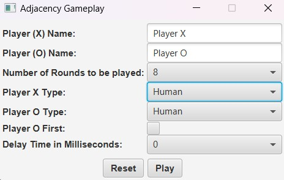
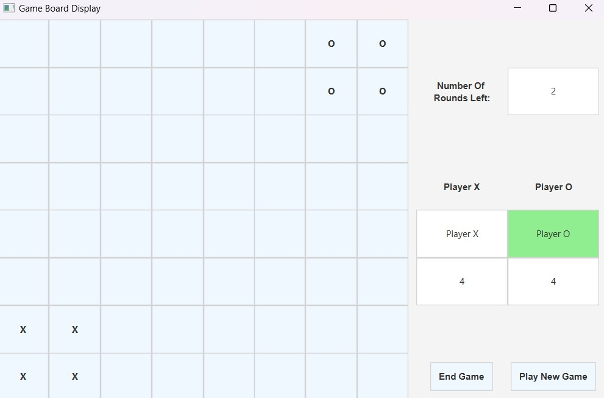
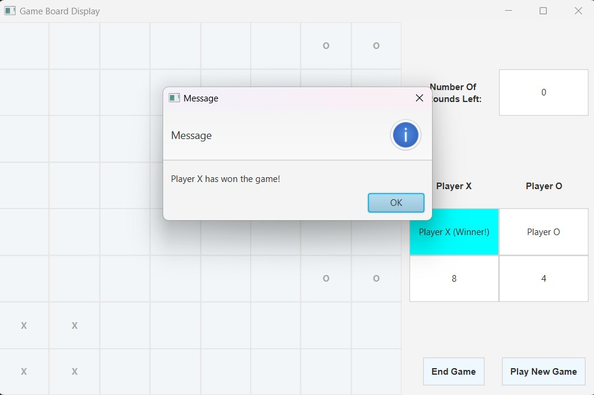
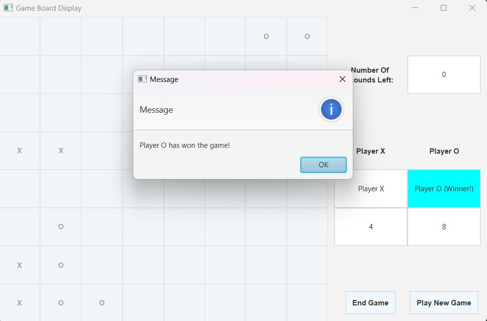
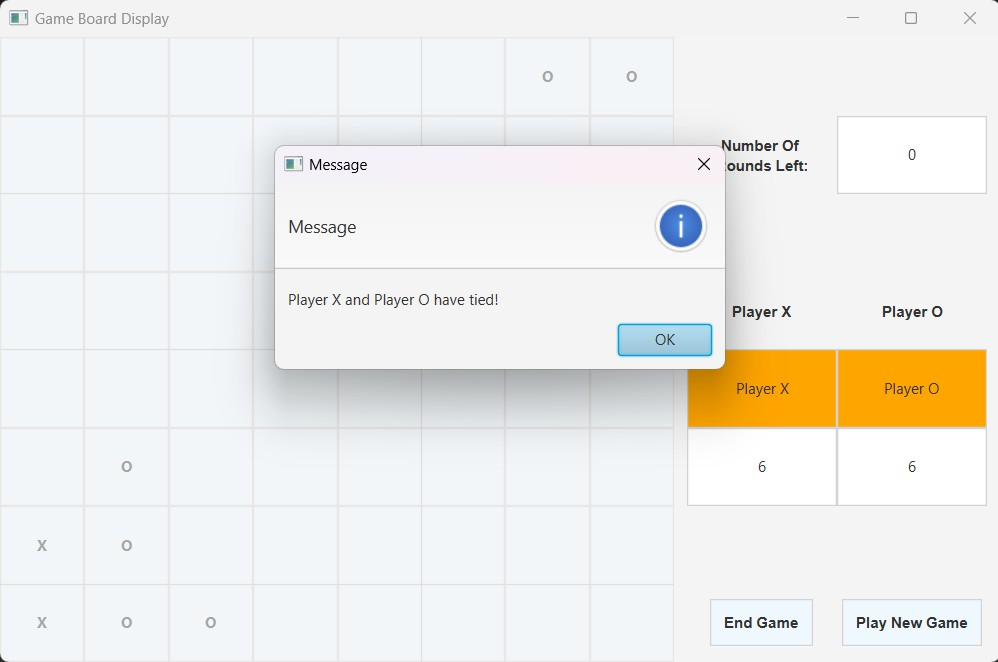

# IF3170_Tubes1
## *Tubes1_Kelompok 5*


## **Table of Contents**
* [Program Description](#program-description)
* [Required Program](#required-program)
* [How to Run The Program](#how-to-run-the-program)
* [Implementation Screenshot](#implementation-screenshot)
* [Authors](#authors)

## **Program Description**
Adjacency Strategy game is a two-players game where both players try to get as many marks as the could.
One player will be using the cross mark (X) while the other player will be using the circle mark (O).
The game will be commenced on an 8x8 board. The game will end if either the board is full or the game has 0 rounds left.

Players can be a human player or a bot. A bot in this game is developed using several algorithm with implementing Artificial Intelligence principles.
The algorithm consists of:
1. The Local Search: Sideways Move,
2. The Local Search: Simulated Annealing, 
3. The Minimax Alpha Beta Pruning, and 
4. The Genetic Algorithm.

## **Required Program**
Here are the things needed to run the program:

| No | Required Program | Reference Link                                                                                |
|----|------------------|-----------------------------------------------------------------------------------------------|
| 1 | JDk v20          | [Java Compiler](https://www.oracle.com/java/technologies/javase/jdk20-archive-downloads.html) |
| 2 | JavaFX           | [JavaFX](https://gluonhq.com/products/javafx/)                                                |
 | 3 | IntellIJ IDEA    | [IntellIJ IDEA](https://www.jetbrains.com/idea/download/?section=windows)                     |


## **How to Run The Program**

1. Clone this repository
```shell
git clone https://github.com/Gulilil/IF3170_Tubes1.git
```
2. Open this directory in IntellIJ IDEA as a new project 
3. Edit the project structure in IntellIJ
` File > Project Structure `
4. Go to Project Section in Project Settings, set the JDK version used in the program 
5. Go to Libraries Section in Project Settings, add a library for the program to detect the JavaFX. 
6. Back to the main screen, edit the run configuration of the project
` Run > Edit Configurations `
7. Add this command on the VM option and the run setting to `Main` object
```shell
--module-path {path to JavaFX} --add-modules=javafx.controls,javafx.fxml
```
8. Run the program

p.s. : If an error occurs regarding the JavaFX, try to manually download the JavaFX and then direct the path into the download JavaFX (not to the one in this repository).

## **Implementation Screenshot**
### User Input Screen

### Game Screen

### End Game: X Player as the Winner

### End Game: O Player as the Winner

### End Game: Tied


## **Authors**
| Name                      | ID       |
|---------------------------|----------|
| Alexander Jason           | 13521100 |
| Juan Christopher Santoso  | 13521116 |
| Nathania Calista Djunaedi | 13521139 |
| Antonio Natthan Krishna   | 13521162 |


